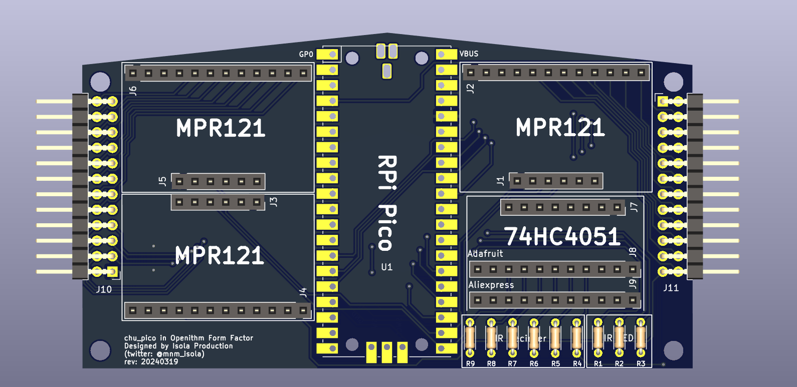
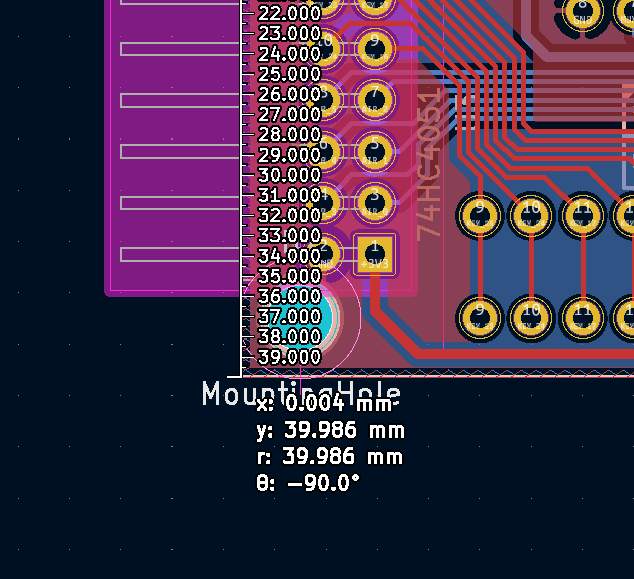
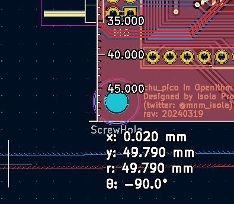

WARNING: UNTESTED

This repository contains PCB design for a direct replacement to the Teensy LC version of OPENITHM board.

Origial build: https://github.com/Yona-W/OpeNITHM
Firmware: https://github.com/whowechina/chu_pico

Note: Capacitive touch *should* work out of the box, air sensors are inherently incompatible until someone write code that support it (into or fork the chu_pico firmware).

Note 2: Size of PCB is slightly longer to accommodate the Pi Pico's length, may not fit into the original OPENITHM's 3D printed case without modification, bottom screw holes have been moved down.

## List of Electronics

| Parts		|      Link      |  Qty|
|----------|:-------------:|------:|
| Raspberry Pi Pico (Preferably a pin-compatible clone with USB-C)|Aliexpress|1|
| Pi Pico Breakout Board 						|[Gerber file (.zip)](/chupico_openithm/gerber/)|1| 
| 74HC4051 Multiplexer Breakout Board 			|[Aliexpress](https://www.aliexpress.com/item/32807771098.html)|1|
| MPR121 Breakout Board 						|Aliexpress|3|
| 51k ohm Resistor THT							|x|6|
| 33 ohm Resistor THT							|x|3|
| 2.54mm Pin Header, Right Angle, 2 row, 24 pos	|[LCSC](https://lcsc.com/product-detail/New-Arrivals_XFCN-PZ254R-12-24P_C492440.html)|2|
| 2.54mm Socket, Straight, 1 row, 20 pos		|x|2|
